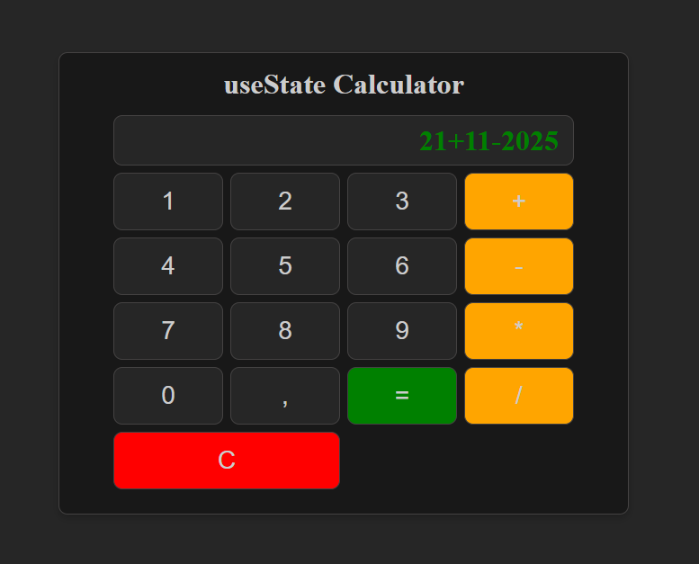

## 📝 useState-Calculator
Проект для закрепления темы из React - useState

⚙️Технологии:
HTML5,
CSS3(SASS),
React,
Vite

## 🚀 Использование:
Требования : Для установки и запуска проекта, необходим NodeJS v8+.

Установка зависимостей
Для установки зависимостей, выполните команду: \
`$ npm i`

Запуск Development сервера
Чтобы запустить сервер для разработки, выполните команду: \
`$ npm run dev`

Создание билда \
Чтобы выполнить production сборку, выполните команду:

`$ npm run build`
